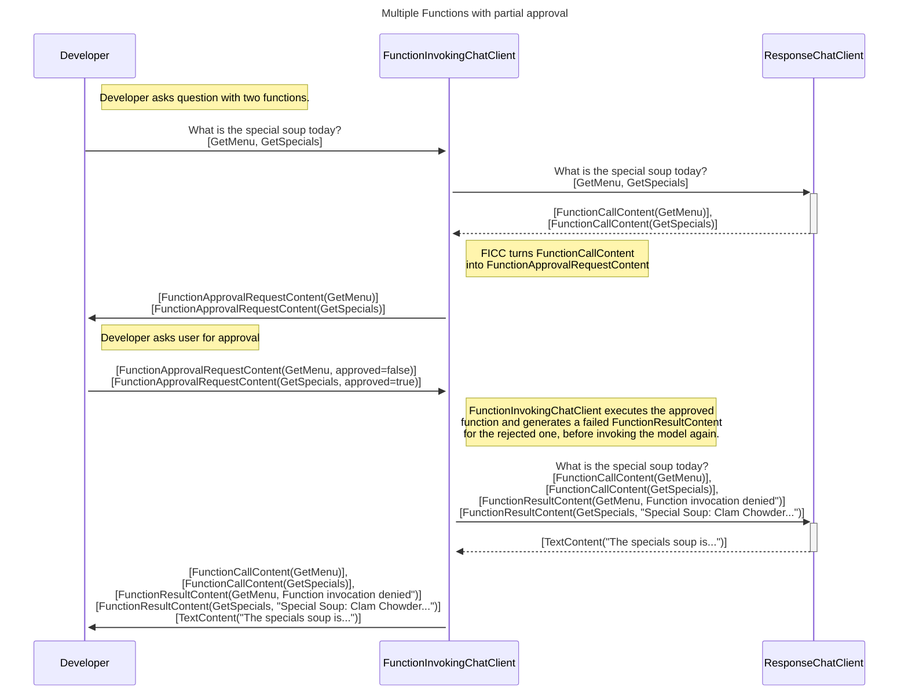
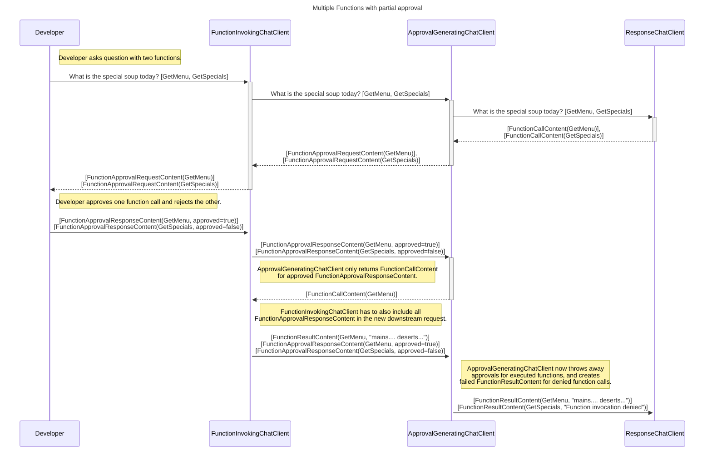
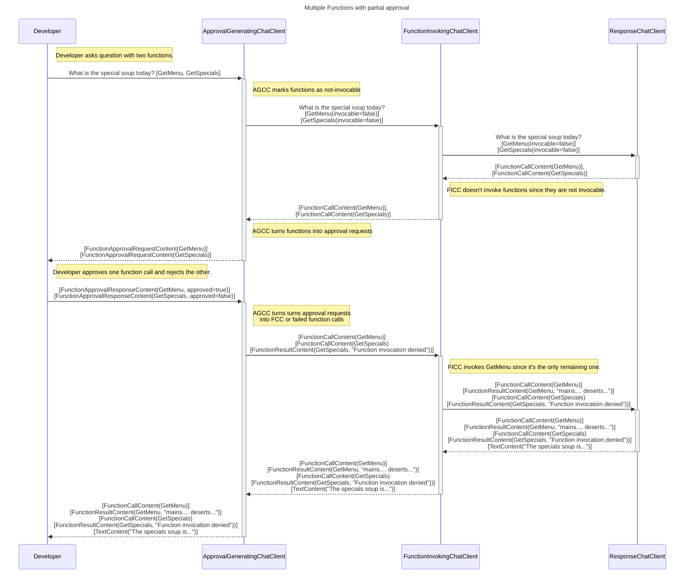

---
# These are optional elements. Feel free to remove any of them.
status: accepted
contact: westey-m
date: 2025-09-12 {YYYY-MM-DD when the decision was last updated}
deciders: sergeymenshykh, markwallace-microsoft, rogerbarreto, dmytrostruk, westey-m, eavanvalkenburg, stephentoub, peterychang
consulted: 
informed: 
---

# Agent User Approvals Content Types and FunctionCall approvals Design

## Context and Problem Statement

When agents are operating on behalf of a user, there may be cases where the agent requires user approval to continue an operation.
This is complicated by the fact that an agent may be remote and the user may not immediately be available to provide the approval.

Inference services are also increasingly supporting built-in tools or service side MCP invocation, which may require user approval before the tool can be invoked.

This document aims to provide options and capture the decision on how to model this user approval interaction with the agent caller.

See various features that would need to be supported via this type of mechanism, plus how various other frameworks support this:

- Also see [dotnet issue 6492](https://github.com/dotnet/extensions/issues/6492), which discusses the need for a similar pattern in the context of MCP approvals.
- Also see [the openai human-in-the-loop guide](https://openai.github.io/openai-agents-js/guides/human-in-the-loop/#approval-requests).
- Also see [the openai MCP guide](https://openai.github.io/openai-agents-js/guides/mcp/#optional-approval-flow).
- Also see [MCP Approval Requests from OpenAI](https://platform.openai.com/docs/guides/tools-remote-mcp#approvals).
- Also see [Azure AI Foundry MCP Approvals](https://learn.microsoft.com/en-us/azure/ai-foundry/agents/how-to/tools/model-context-protocol-samples?pivots=rest#submit-your-approval).
- Also see [MCP Elicitation requests](https://modelcontextprotocol.io/specification/draft/client/elicitation)

## Decision Drivers

- Agents should encapsulate their internal logic and not leak it to the caller.
- We need to support approvals for local actions as well as remote actions.
- We need to support approvals for service-side tool use, such as remote MCP tool invocations
- We should consider how other user input requests will be modeled, so that we can have a consistent approach for user input requests and approvals.

## Considered Options

### 1. Return a FunctionCallContent to the agent caller, that it executes

This introduces a manual function calling element to agents, where the caller of the agent is expected to invoke the function if the user approves it.

This approach is problematic for a number of reasons:

- This may not work for remote agents (e.g. via A2A), where the function that the agent wants to call does not reside on the caller's machine.
- The main value prop of an agent is to encapsulate the internal logic of the agent, but this leaks that logic to the caller, requiring the caller to know how to invoke the agent's function calls.
- Inference services are introducing their own approval content types for server side tool or function invocation, and will not be addressed by this approach.

### 2. Introduce an ApprovalCallback in AgentRunOptions and ChatOptions

This approach allows a caller to provide a callback that the agent can invoke when it requires user approval.

This approach is easy to use when the user and agent are in the same application context, such as a desktop application, where the application can show the approval request to the user and get their response from the callback before continuing the agent run.

This approach does not work well for cases where the agent is hosted in a remote service, and where there is no user available to provide the approval in the same application context.
For cases like this, the agent needs to be suspended, and a network response must be sent to the client app. After the user provides their approval, the client app must call the service that hosts the agent again, with the user's decision, and the agent needs to be resumed.  However, with a callback, the agent is deep in the call stack and cannot be suspended or resumed like this.

```csharp
class AgentRunOptions
{
    public Func<ApprovalRequestContent, Task<ApprovalResponseContent>>? ApprovalCallback { get; set; }
}

agent.RunAsync("Please book me a flight for Friday to Paris.", thread, new AgentRunOptions
{
    ApprovalCallback = async (approvalRequest) =>
    {
        // Show the approval request to the user in the appropriate format.
        // The user can then approve or reject the request.
        // The optional FunctionCallContent can be used to show the user what function the agent wants to call with the parameter set:
        // approvalRequest.FunctionCall?.Arguments.

        // If the user approves:
        return true;
    }
});
```

### 3. Introduce new ApprovalRequestContent and ApprovalResponseContent types

The agent would return an `ApprovalRequestContent` to the caller, which would then be responsible for getting approval from the user in whatever way is appropriate for the application.
The caller would then invoke the agent again with an `ApprovalResponseContent` to the agent containing the user decision.

When an agent returns an `ApprovalRequestContent`, the run is finished for the time being, and to continue, the agent must be invoked again with an `ApprovalResponseContent` on the same thread as the original request. This doesn't of course have to be the exact same thread object, but it should have the equivalent contents as the original thread, since the agent would have stored the `ApprovalRequestContent` in its thread state.

The `ApprovalRequestContent` could contain an optional `FunctionCallContent` if the approval is for a function call, along with any additional information that the agent wants to provide to the user to help them make a decision.

It is up to the agent to decide when and if a user approval is required, and therefore when to return an `ApprovalRequestContent`.

`ApprovalRequestContent` and `ApprovalResponseContent` will not necessarily always map to a supported content type for the underlying service or agent thread storage.
Specifically, when we are deciding in the IChatClient stack to ask for approval from the user, for a function call, this does not mean that the underlying ai service or
service side thread type (where applicable) supports the concept of a function call approval request.  While we can store the approval requests and response in local
threads, service managed threads won't necessarily support this.  For service managed threads, there will therefore be no long term record of the approval request in the chat history.
We should however log approvals so that there is a trace of this for debugging and auditing purposes.

Suggested Types:

```csharp
class ApprovalRequestContent : AIContent
{
    // An ID to uniquely identify the approval request/response pair.
    public string Id { get; set; }

    // An optional user targeted message to explain what needs to be approved.
    public string? Text { get; set; }

    // Optional: If the approval is for a function call, this will contain the function call content.
    public FunctionCallContent? FunctionCall { get; set; }

    public ApprovalResponseContent CreateApproval()
    {
        return new ApprovalResponseContent
        {
            Id = this.Id,
            Approved = true,
            FunctionCall = this.FunctionCall
        };
    }

    public ApprovalResponseContent CreateRejection()
    {
        return new ApprovalResponseContent
        {
            Id = this.Id,
            Approved = false,
            FunctionCall = this.FunctionCall
        };
    }
}

class ApprovalResponseContent : AIContent
{
    // An ID to uniquely identify the approval request/response pair.
    public string Id { get; set; }

    // Indicates whether the user approved the request.
    public bool Approved { get; set; }

    // Optional: If the approval is for a function call, this will contain the function call content.
    public FunctionCallContent? FunctionCall { get; set; }
}

var response = await agent.RunAsync("Please book me a flight for Friday to Paris.", thread);
while (response.ApprovalRequests.Count > 0)
{
    List<ChatMessage> messages = new List<ChatMessage>();
    foreach (var approvalRequest in response.ApprovalRequests)
    {
        // Show the approval request to the user in the appropriate format.
        // The user can then approve or reject the request.
        // The optional FunctionCallContent can be used to show the user what function the agent wants to call with the parameter set:
        // approvalRequest.FunctionCall?.Arguments.
        // The Text property of the ApprovalRequestContent can also be used to show the user any additional textual context about the request.
    
        // If the user approves:
        messages.Add(new ChatMessage(ChatRole.User, [approvalRequest.CreateApproval()]));
    }

    // Get the next response from the agent.
    response = await agent.RunAsync(messages, thread);
}

class AgentRunResponse
{
    ...

    // A new property on AgentRunResponse to aggregate the ApprovalRequestContent items from
    // the response messages (Similar to the Text property).
    public IEnumerable<ApprovalRequestContent> ApprovalRequests { get; set; }

    ...
}
```

### 4. Introduce new Container UserInputRequestContent and UserInputResponseContent types

This approach is similar to the `ApprovalRequestContent` and `ApprovalResponseContent` types, but is more generic and can be used for any type of user input request, not just approvals.

There is some ambiguity with this approach. When using an LLM based agent the LLM may return a text response about missing user input.
E.g the LLM may need to invoke a function but the user did not supply all necessary information to fill out all arguments.
Typically an LLM would just respond with a text message asking the user for the missing information.
In this case, the message is not distinguishable from any other result message, and therefore cannot be returned to the caller as a `UserInputRequestContent`, even though it is conceptually a type of unstructured user input request. Ultimately our types are modeled to make it easy for callers to decide on the right way to represent this to users. E.g. is it just a regular message to show to users, or do we need a special UX for it.

Suggested Types:

```csharp
class UserInputRequestContent : AIContent
{
    // An ID to uniquely identify the approval request/response pair.
    public string ApprovalId { get; set; }

    // DecisionTarget could contain:
    // FunctionCallContent: The function call that the agent wants to invoke.
    // TextContent: Text that describes the question for that the user should answer.
    object? DecisionTarget { get; set; } // Anything else the user may need to make a decision about.

    // Possible InputFormat subclasses:
    //   SchemaInputFormat: Contains a schema for the user input.
    //   ApprovalInputFormat: Indicates that the user needs to approve something.
    //   FreeformTextInputFormat: Indicates that the user can provide freeform text input.
    // Other formats can be added as needed, e.g. cards when using activity protocol.
    public InputFormat InputFormat { get; set; } // How the user should provide input (e.g., form, options, etc.).
}

class UserInputResponseContent : AIContent
{
    // An ID to uniquely identify the approval request/response pair.
    public string ApprovalId { get; set; }

    // Possible UserInputResult subclasses:
    //   SchemaInputResult: Contains the structured data provided by the user.
    //   ApprovalResult: Contains a bool with approved / rejected.
    //   FreeformTextResult: Contains the freeform text input provided by the user.
    public UserInputResult Result { get; set; } // The user input.

    public object? DecisionTarget { get; set; } // A copy of the DecisionTarget from the UserInputRequestContent, if applicable.
}

var response = await agent.RunAsync("Please book me a flight for Friday to Paris.", thread);
while (response.UserInputRequests.Any())
{
    List<ChatMessage> messages = new List<ChatMessage>();
    foreach (var userInputRequest in response.UserInputRequests)
    {
        // Show the user input request to the user in the appropriate format.
        // The DecisionTarget can be used to show the user what function the agent wants to call with the parameter set.
        // The InputFormat property can be used to determine the type of UX when allowing users to provide input.

        if (userInputRequest.InputFormat is ApprovalInputFormat approvalInputFormat)
        {
            // Here we need to show the user an approval request.
            // We can use the DecisionTarget to show e.g. the function call that the agent wants to invoke.
            // The user can then approve or reject the request.
    
            // If the user approves:
            var approvalMessage = new ChatMessage(ChatRole.User, new UserInputResponseContent {  
                ApprovalId = userInputRequest.ApprovalId,
                Result = new ApprovalResult { Approved = true },
                DecisionTarget = userInputRequest.DecisionTarget
            });
            messages.Add(approvalMessage);
        }
        else
        {
            throw new NotSupportedException("Unsupported InputFormat type.");
        }
    }

    // Get the next response from the agent.
    response = await agent.RunAsync(messages, thread);
}

class AgentRunResponse
{
    ...

    // A new property on AgentRunResponse to aggregate the UserInputRequestContent items from
    // the response messages (Similar to the Text property).
    public IReadOnlyList<UserInputRequestContent> UserInputRequests { get; set; }

    ...
}
```

### 5. Introduce new Base UserInputRequestContent and UserInputResponseContent types

This approach is similar to option 4, but the `UserInputRequestContent` and `UserInputResponseContent` types are base classes rather than generic container types.

Suggested Types:

```csharp
class UserInputRequestContent : AIContent
{
    // An ID to uniquely identify the approval request/response pair.
    public string Id { get; set; }
}

class UserInputResponseContent : AIContent
{
    // An ID to uniquely identify the approval request/response pair.
    public string Id { get; set; }
}

// -----------------------------------
// Used for approving a function call.
class FunctionApprovalRequestContent : UserInputRequestContent
{
    // Contains the function call that the agent wants to invoke.
    public FunctionCallContent FunctionCall { get; set; }

    public ApprovalResponseContent CreateApproval()
    {
        return new ApprovalResponseContent
        {
            Id = this.Id,
            Approved = true,
            FunctionCall = this.FunctionCall
        };
    }

    public ApprovalResponseContent CreateRejection()
    {
        return new ApprovalResponseContent
        {
            Id = this.Id,
            Approved = false,
            FunctionCall = this.FunctionCall
        };
    }
}
class FunctionApprovalResponseContent : UserInputResponseContent
{
    // Indicates whether the user approved the request.
    public bool Approved { get; set; }

    // Contains the function call that the agent wants to invoke.
    public FunctionCallContent FunctionCall { get; set; }
}

// --------------------------------------------------
// Used for approving a request described using text.
class TextApprovalRequestContent : UserInputRequestContent
{
    // A user targeted message to explain what needs to be approved.
    public string Text { get; set; }
}
class TextApprovalResponseContent : UserInputResponseContent
{
    // Indicates whether the user approved the request.
    public bool Approved { get; set; }
}

// ------------------------------------------------
// Used for providing input in a structured format.
class StructuredDataInputRequestContent : UserInputRequestContent
{
    // A user targeted message to explain what is being requested.
    public string? Text { get; set; }

    // Contains the schema for the user input.
    public JsonElement Schema { get; set; }
}
class StructuredDataInputResponseContent : UserInputResponseContent
{
    // Contains the structured data provided by the user.
    public JsonElement StructuredData { get; set; }
}

var response = await agent.RunAsync("Please book me a flight for Friday to Paris.", thread);
while (response.UserInputRequests.Any())
{
    List<ChatMessage> messages = new List<ChatMessage>();
    foreach (var userInputRequest in response.UserInputRequests)
    {
        if (userInputRequest is FunctionApprovalRequestContent approvalRequest)
        {
            // Here we need to show the user an approval request.
            // We can use the FunctionCall property to show e.g. the function call that the agent wants to invoke.
            // If the user approves:
            messages.Add(new ChatMessage(ChatRole.User, approvalRequest.CreateApproval()));
        }
    }

    // Get the next response from the agent.
    response = await agent.RunAsync(messages, thread);
}

class AgentRunResponse
{
    ...

    // A new property on AgentRunResponse to aggregate the UserInputRequestContent items from
    // the response messages (Similar to the Text property).
    public IEnumerable<UserInputRequestContent> UserInputRequests { get; set; }

    ...
}
```

## Decision Outcome

Chosen option 5.

## Appendices

### ChatClientAgent Approval Process Flow

1. User passes a User message to the agent with a request.
1. Agent calls IChatClient with any functions registered on the agent.
   (IChatClient has FunctionInvokingChatClient)
1. Model responds with FunctionCallContent indicating function calls required.
1. FunctionInvokingChatClient decorator identifies any function calls that require user approval and returns an FunctionApprovalRequestContent.
   (If there are multiple parallel function calls, all function calls will be returned as FunctionApprovalRequestContent even if only some require approval.)
1. Agent updates the thread with the FunctionApprovalRequestContent (or this may have already been done by a service threaded agent).
1. Agent returns the FunctionApprovalRequestContent to the caller which shows it to the user in the appropriate format.
1. User (via caller) invokes the agent again with FunctionApprovalResponseContent.
1. Agent adds the FunctionApprovalResponseContent to the thread.
1. Agent calls IChatClient with the provided FunctionApprovalResponseContent.
1. Agent invokes IChatClient with FunctionApprovalResponseContent and the FunctionInvokingChatClient decorator identifies the response as an approval for the function call.
   Any rejected approvals are converted to FunctionResultContent with a message indicating that the function invocation was denied.
   Any approved approvals are executed by the FunctionInvokingChatClient decorator.
1. FunctionInvokingChatClient decorator passes the FunctionCallContent and FunctionResultContent for the approved and rejected function calls to the model.
1. Model responds with the result.
1. FunctionInvokingChatClient returns the FunctionCallContent, FunctionResultContent, and the result message to the agent.
1. Agent responds to caller with the same messages and updates the thread with these as well.

### CustomAgent Approval Process Flow

1. User passes a User message to the agent with a request.
1. Agent adds this message to the thread.
1. Agent executes various steps.
1. Agent encounters a step for which it requires user input to continue.
1. Agent responds with an UserInputRequestContent and also adds it to its thread.
1. User (via caller) invokes the agent again with UserInputResponseContent.
1. Agent adds the UserInputResponseContent to the thread.
1. Agent responds to caller with result message and thread is updated with the result message.

### Sequence Diagram: FunctionInvokingChatClient with built in Approval Generation

This is a ChatClient Approval Stack option has been proven to work via a proof of concept implementation.



### Sequence Diagram: Post FunctionInvokingChatClient ApprovalGeneratingChatClient - Multiple function calls with partial approval

This is a discarded ChatClient Approval Stack option, but is included here for reference.



### Sequence Diagram: Pre FunctionInvokingChatClient ApprovalGeneratingChatClient - Multiple function calls with partial approval

This is a discarded ChatClient Approval Stack option, but is included here for reference.

It doesn't work for the scenario where we have multiple function calls for the same function in serial with different arguments.

Flow:

- AGCC turns AIFunctions into AIFunctionDefinitions (not invocable) and FICC ignores these.
- We get back a FunctionCall for one of these and it gets approved.
- We invoke the FICC again, this time with an AIFunction.
- We call the service with the FCC and FRC.
- We get back a new Function call for the same function again with different arguments.
- Since we were passed an AIFunction instead of an AIFunctionDefinition, we now incorrectly execute this FC without approval.


