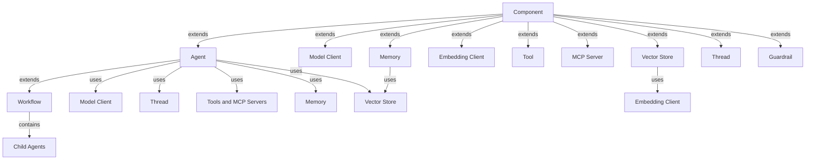

# Agent Framework Design Doc

What values does the framework provide?

- A set of configurable, extensible and high-quality components (e.g., model clients, tools, MCP servers and memory).
- An easy path for deploying, securing and scaling applications, both locally and in the cloud.
- Integration with tools for monitoring, debugging, evaluation and optimization, both locally and in the cloud.
- A community of developers and users for support, ideas, and contributions, benefiting everyone in the ecosystem.

What is this document?

- An overview of the new framework.
- Defining the major elements of the framework and their relationships.
- Detailed design of each element and its implementation will be in a separate document.

## Core Data Types

To unify the interaction between components, we define a set of core
data types that are used throughout the framework.

See [Core Data Types](types.md) for more details.

## Components

A component is a class that provides a specific functionality and can be used
independently by applications.
There are two types of components in the framework: agent components and agents. Agent components are the building blocks of agents, while agents are
the higher-level components, and can be composed from agent components
and other agents (as in workflows).

The framework defines the following components. Follow the links to
find the design details of each component:

- Agent Components:
  - [Model Client](models.md)
  - [Vector Store and Embedding Client](vector-stores.md)
  - [Tool](tools.md)
  - [MCP Server](mcp-servers.md)
  - [Memory](memory.md)
  - [Thread](threads.md)
  - [Guardrail](guardrails.md)
- Agent and Workflow:
  - [Agent](agents.md)
  - [Workflow](workflows.md)

### Composition

Components can be composed to create complex components. For example,
an agent can be composed from model clients, tools and memory,
and a tool can be composed from an agent or a workflow.
It is the responsibility of the framework to validate components
and their composition.

### Configuration

A component can be created from a set of serializable configuration parameters,
with the help of dependency injection to resolve non-serializable dependencies.

### Relationships

The following diagram shows the component relationship of the framework:

## Deployment and Scaling

[Deployment](deployment.md).

## Observability and Monitoring

[Observability](observability.md).

## Evaluation

[Evaluation](evaluation.md).

## Optimization

[Optimization](optimization.md).