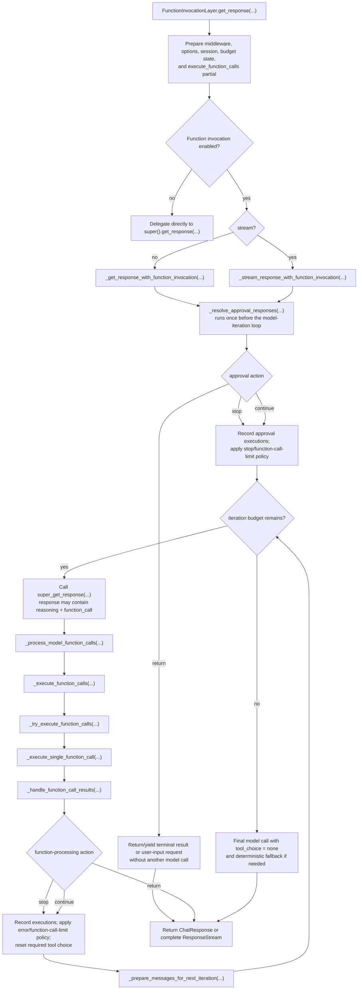
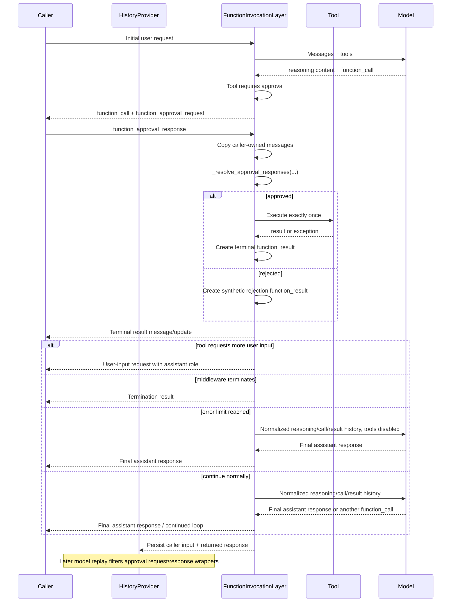
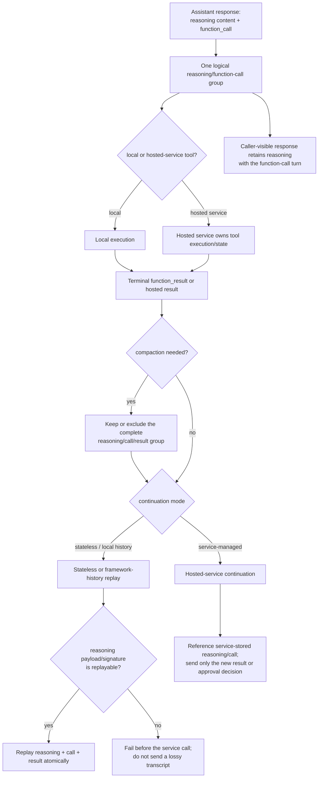
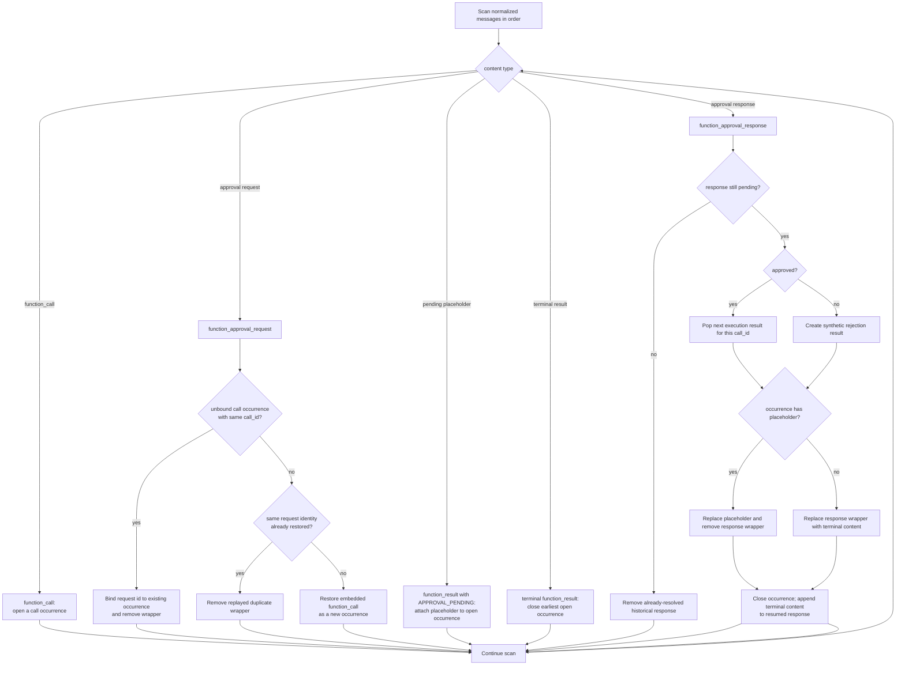
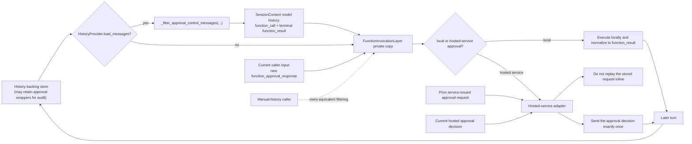

# Python function-calling loop contract and validation matrix

## Scope

This specification defines the required behavior and validation coverage for the Python function-calling loop.
It covers:

- normal local function execution;
- streaming and non-streaming response aggregation;
- tool approval request and resume;
- approved, rejected, mixed, and replayed approval rounds;
- reasoning content and opaque reasoning signatures bound to function calls;
- history persistence and service-side continuation;
- error, user-input, middleware-termination, and loop-limit paths;
- provider and transport serialization of function calls and results.

The primary implementation is in `python/packages/core/agent_framework/_tools.py`. History replay behavior in
`python/packages/core/agent_framework/_sessions.py`, provider serializers, hosting packages, and UI transports are
part of the same contract when they carry function-call loop content.

## Change sensitivity

This code is high risk. Small changes can produce duplicate side effects, orphaned calls or results, invalid
provider histories, invisible streaming results, stale approval authority, or loops that never terminate.
Dropping reasoning content that a service binds to a tool call can also make an otherwise balanced call/result
transcript invalid.

Any change to the function-calling loop or its approval/history/serialization paths must:

1. identify every affected row in the scenario matrix below;
2. add or update the corresponding regression tests;
3. validate streaming updates, streaming finalization, and non-streaming output where applicable;
4. validate both model-bound history and caller-visible responses;
5. run the full core package tests plus every affected provider or transport package;
6. run source typing, test typing, and syntax checks for every affected package;
7. receive extra review focused on call/result pairing, exactly-once execution, and history replay.

A passing narrow regression test is not sufficient evidence for changes in this area.

### Contribution ownership

Issues involving this code must not be picked up by external contributors without first checking with the Agent
Framework core team. The core team must confirm the intended behavior, affected scenario-matrix rows, ownership
across core/providers/transports, and the required validation scope before implementation starts.

## Flow diagrams and code map

### Main function-calling flow

The main control flow deliberately has separate streaming and non-streaming methods. They share policy helpers, but
their output mechanics differ: one returns an aggregated `ChatResponse`; the other yields `ChatResponseUpdate`
items and is finalized by `ResponseStream`.

The diagrams use only the generic distinction between **local tools**, which Agent Framework executes, and
**hosted-service tools**, whose calls and approval decisions are owned by a remote service. Provider-specific wire
formats and regression tests appear later in the scenario matrix.



Code-reading landmarks:

- `get_response(...)` owns setup and selects the response mode.
- `_get_response_with_function_invocation(...)` owns non-streaming aggregation.
- `_stream_response_with_function_invocation(...)` owns streamed emission/finalization.
- `_resolve_approval_responses(...)` handles only inbound approval decisions.
- `_process_model_function_calls(...)` handles only calls from a completed model response.
- `_try_execute_function_calls(...)` decides approval/declaration/execution behavior for a batch.
- `_replace_approval_contents_with_results(...)` is the occurrence-aware approval transcript normalizer.

### Approval pause and resume



The terminal result is caller-visible in both modes. The private normalized message copy is model-visible. The
original caller input and earlier response remain unchanged.

### Reasoning-bound function-call groups

Some hosted services bind reasoning content or an opaque reasoning signature to the function call that follows it.
For those services, reasoning is not optional decoration; it is part of the provider-valid function-call group.



The generic contract is:

- reasoning content remains ordered immediately before or alongside the function call it explains;
- a terminal result does not replace or discard the reasoning/call portion of the active group;
- stateless replay includes the service-required reasoning payload or opaque signature;
- if required reasoning cannot be reconstructed, the adapter fails before sending invalid or lossy history;
- service-managed continuation may rely on the hosted service's stored reasoning/call items and send only new
  outputs or approval decisions;
- compaction keeps or removes the entire reasoning/call/result group atomically.

In the code, core response aggregation preserves reasoning `Content` items, compaction annotations bind reasoning to
the tool-call group, and provider adapters serialize or reconstruct the provider-specific reasoning representation.

### Approval correlation, replay, and reused ids

`call_id` is not globally unique forever. The normalizer therefore tracks open logical occurrences in transcript
order instead of keeping one global result per id.



This flow corresponds to `_ApprovalCallOccurrence`, `_collect_approval_responses(...)`, and
`_replace_approval_contents_with_results(...)`.

### History and service-side continuation



When `load_messages=False`, no history is replayed and the history filter is intentionally not invoked. Callers
that manually replay messages own the equivalent rule: do not resend an approval response after its terminal result.

## Normative contract

### Function calls and results

- Every actionable local `function_call` produces exactly one terminal `function_result`, unless execution pauses
  for a new user-input request.
- Parallel calls retain model order in the returned transcript.
- Reused `call_id` values are correlated by logical occurrence, not one global value per id.
- A completed function call/result pair is inert on later turns.
- Informational-only and declaration-only calls are not executed as local tools.

### Reasoning-bound calls

- Reasoning content or opaque reasoning metadata that a service binds to a function call is part of the same logical
  group as that call and its terminal result.
- Active function loops preserve the reasoning content, function call, function result, and final assistant output
  in caller-visible responses.
- Framework-managed/stateless replay includes the service-required reasoning representation before the paired call.
- Service-managed continuation may omit inline reasoning/call items only when the hosted service already owns them.
- Missing non-reconstructable reasoning fails explicitly before a provider request instead of silently dropping the
  content.
- Foundry clients do not request `reasoning.encrypted_content` implicitly; callers may opt in explicitly when the
  selected deployment supports encrypted reasoning.
- Compaction preserves or excludes the complete reasoning/call/result group atomically.

### Approval request and resume

- A tool that requires approval does not execute before an approved response.
- An approved tool executes exactly once.
- A rejected tool executes zero times and produces one synthetic rejection `function_result` using the original
  function `call_id`.
- The resumed response contains the newly resolved approved and rejected terminal results before any final assistant
  message.
- Streaming yields the same logical result content and ordering as non-streaming output and
  `ResponseStream.get_final_response()`.
- The function invocation layer normalizes a private copy of caller messages. It must not mutate the caller's
  approval `Message`, approval `Content`, or an earlier returned response.
- Approval-time `UserInputRequiredException` and `MiddlewareTermination` return immediately without another model
  call.

### Approval control content

- `function_approval_request` and `function_approval_response` are control-plane contents, not durable model
  transcript items.
- A current hosted approval response must be sent once on the immediate resume request.
- AG-UI removes a local approval response from its request and snapshot replay when a terminal result belongs to an
  already-consumed occurrence, including result-before-response replay. A client-authored result in the occurrence
  that is still registered as pending does not prove completion: AG-UI removes that result, keeps the validated
  response for local execution, and leaves hosted approval responses as provider protocol data.
- Hosted AG-UI approval interrupts expose an accept/reject decision only; argument edits are rejected because the
  hosted provider executes the server-owned request rather than client-edited arguments.
- A server-issued approval request must not be replayed inline during service-side continuation.
- History providers may retain approval control contents in their backing store for audit, but base history replay
  filters them before later model calls.
- Callers that manually own and replay message history without a loading `HistoryProvider` must likewise omit a
  previously submitted approval response from later continuation requests.

### History and continuation

- Model-bound history contains one function call/result pair per completed logical occurrence.
- Append-only history must not replay stale approval request/response wrappers to the model.
- Framework-managed and service-managed continuation must preserve the same logical call/result transcript.
- A streaming response rebuilt from updates by an intermediate middleware must carry over the inner response's
  conversation id and its internal-conversation-id marker, so framework-managed continuation appends only the latest
  message instead of replaying a transcript the provider already holds. The rebuilt response mirrors the inner
  conversation id exactly, including clearing it, and never retains an id emitted by an earlier service call in the
  same turn.
- A trusted terminal result consumes the corresponding approval authority in explicit stateless replay; a result in a
  server-registered pending occurrence cannot consume that authority before local execution.

## Scenario-to-test matrix

### Normal function invocation

| Scenario | Required invariant | Primary regression test |
|---|---|---|
| Single non-streaming call | Call, result, and final assistant message are returned in order. | `packages/core/tests/core/test_function_invocation_logic.py::test_base_client_with_function_calling` |
| String input | Flexible string input follows the same loop behavior. | `test_base_client_with_function_calling_string_input` |
| Multiple sequential rounds | Each round retains one call/result pair. | `test_base_client_with_function_calling_resets` |
| Streaming call | Call chunks, one result update, and final text are emitted in order. | `test_base_client_with_streaming_function_calling` |
| Reasoning-bound call | Finalized output retains reasoning, function call, function result, and final text. | `test_streaming_function_calling_response_includes_reasoning_and_tool_results` |
| Calls across response messages | Every actionable call is executed once. | `test_base_client_executes_function_calls_across_multiple_response_messages` |
| Parallel calls | Results retain the corresponding call ids and execution count. | `test_max_function_calls_limits_parallel_invocations`, `test_streaming_multiple_function_calls_parallel_execution` |
| Informational-only call | The call is returned but not executed or approved. | `test_informational_only_function_call_is_not_invoked`, `test_informational_only_function_call_does_not_request_approval`, `test_streaming_informational_only_function_call_is_not_invoked` |
| Declaration-only call | The call is surfaced as user input and is not executed; streaming arguments appear once while finalized request metadata remains available. | `test_declaration_only_tool`, `test_streaming_declaration_only_tool_preserves_metadata_without_duplicate_arguments` |
| Function invocation disabled | The client bypasses the invocation loop without losing invocation kwargs. | `test_function_invocation_config_enabled_false`, `test_function_invocation_config_enabled_false_preserves_invocation_kwargs`, `test_streaming_function_invocation_config_enabled_false` |
| Runtime tool changes | Added tools become available on the next iteration and retain approval behavior. | `test_add_tools_available_next_iteration`, `test_add_tools_with_approval_required_tool` |

### Approval pause and resume

| Scenario | Required invariant | Primary regression test |
|---|---|---|
| Initial approval request | Assistant response contains the original call and approval request; tool does not execute. | `test_approval_requests_in_assistant_message`, `test_streaming_approval_request_generated`, `test_streaming_approval_requests_in_assistant_message` |
| Approved non-streaming resume | Result precedes final text; tool executes once; inputs remain unchanged. | `packages/core/tests/core/test_harness_tool_approval.py::test_approval_resume_returns_result_without_mutating_inputs[non-streaming-approved]` |
| Rejected non-streaming resume | Rejection result precedes final text; tool executes zero times; inputs remain unchanged. | `test_approval_resume_returns_result_without_mutating_inputs[non-streaming-rejected]` |
| Approved streaming resume | Result update precedes final text and final response matches non-streaming shape. | `test_approval_resume_returns_result_without_mutating_inputs[streaming-approved]`, `test_streaming_approval_resume_yields_terminal_result_before_model_text[approved]` |
| Rejected streaming resume | Rejection result update precedes final text and tool executes zero times. | `test_approval_resume_returns_result_without_mutating_inputs[streaming-rejected]`, `test_streaming_approval_resume_yields_terminal_result_before_model_text[rejected]` |
| Mixed approved/rejected batch | Every call gets one correctly correlated terminal result. | `packages/core/tests/core/test_function_invocation_logic.py::test_rejected_approval` |
| Persisted approval replay | Resume executes with the prior call available. | `test_persisted_approval_messages_replay_correctly` |
| Hosted approval pass-through | Hosted requests/responses are not processed as local calls. | `test_hosted_tool_approval_response`, `test_hosted_mcp_approval_response_passthrough`, `test_mixed_local_and_hosted_approval_flow` |
| Approval-time user input | Every user-input request from one approved execution returns in order with assistant role and no extra model call; the execution consumes one call-budget unit. | `packages/core/tests/core/test_harness_tool_approval.py::test_approval_resume_returns_all_user_input_requests_without_another_model_call`, `packages/core/tests/core/test_function_invocation_logic.py::test_approval_resume_user_input_counts_toward_function_call_budget` |
| Mixed terminal result and follow-up input | Completed siblings remain tool-role while only follow-up input requests use assistant-role messages/updates. | `packages/core/tests/core/test_function_invocation_logic.py::test_approval_resume_separates_terminal_results_from_follow_up_requests`, `packages/openai/tests/openai/test_openai_chat_completion_client.py::test_mixed_approval_resume_roles_serialize_function_result_as_tool` |
| Approval-time middleware termination | Terminal result returns with no extra model call in either response mode. | `packages/core/tests/core/test_function_invocation_logic.py::test_approval_resume_honors_middleware_termination` |
| Approval re-entry after iteration budget | Pending approved calls resolve once even when prior model calls consumed `max_iterations`. | `packages/core/tests/core/test_harness_tool_approval.py::test_auto_approval_resolves_after_iteration_budget_is_exhausted` |
| Approval resume with reasoning | Model-bound resume history retains reasoning before the call and terminal result in both modes. | `packages/core/tests/core/test_harness_tool_approval.py::test_approval_resume_replays_reasoning_with_function_call_group` |

### Approval correlation and replay

| Scenario | Required invariant | Primary regression test |
|---|---|---|
| Result matching without placeholders | Results match calls by id even when the result list is reordered. | `test_replace_approval_contents_with_results_uses_result_call_ids_without_placeholders` |
| Reused id after completion | A later round with the same id creates a second valid pair. | `test_replace_approval_contents_with_results_allows_reused_call_id_after_completion` |
| Replayed approval wrapper | A duplicated wrapper does not restore another function call. | `test_replace_approval_contents_with_results_deduplicates_replayed_approval_request` |
| Historical resolved response plus new round | The old response is removed from normalized input and is not converted into a rejection result. | `test_replace_approval_contents_with_results_ignores_already_resolved_response` |
| Multiple reused-id rounds | Approved and rejected rounds retain separate call/result occurrences. | `test_replace_approval_contents_with_results_correlates_reused_call_id_occurrences` |
| Multi-content result with reused id | Every content produced by one execution stays with that approval occurrence and cannot bleed into the next reused-id round. | `test_replace_approval_contents_with_results_keeps_multi_content_group_with_reused_call_id` |
| Follow-up request closes one occurrence | A user-input follow-up consumes only the preceding approval authority and leaves a later reused-id response pending. | `test_collect_approval_responses_consumes_matching_follow_up_request_occurrence` |
| Reused-id placeholders | Placeholder results consume approved results by occurrence. | `test_replace_approval_contents_with_results_correlates_reused_call_id_placeholders` |
| Rejected placeholder | Rejection replaces the pending placeholder instead of adding a second result. | `test_replace_approval_contents_with_results_replaces_rejected_placeholder` |
| Results reordered with placeholders | Results still match the correct call ids. | `test_replace_approval_contents_with_results_uses_result_call_ids_for_placeholders` |
| Missing result call id | A malformed result does not steal another approval's result. | `test_replace_approval_contents_with_results_skips_results_without_call_id` |
| Empty approval message cleanup | Fully consumed approval messages are removed from normalized model input. | `test_replace_approval_contents_with_results_prunes_emptied_messages` |
| Later stateless turn | A prior terminal approval response cannot execute again. | `test_resolved_approval_response_is_inert_on_later_stateless_turn` |
| Pending history turn | An unresolved approval batch is omitted atomically from unrelated model input while a later decision can still resume it once. | `packages/core/tests/core/test_harness_tool_approval.py::test_pending_approval_from_file_history_stays_resumable_without_model_orphan` |
| Duplicate function-call prevention | Approval normalization does not create a second call for one round. | `test_no_duplicate_function_calls_after_approval_processing` |
| Rejection call id | Rejection result uses the function call id, not only the approval id. | `test_rejection_result_uses_function_call_id` |

### Mixed batches and approval middleware

| Scenario | Required invariant | Primary regression test |
|---|---|---|
| Safe and approval-required calls in one batch | Hidden safe calls replay only with the matching visible approval. | `packages/core/tests/core/test_harness_tool_approval.py::test_mixed_batch_hides_already_approved_request_until_approval_replay` |
| Restored approval state | Serialized `ToolApprovalState` restores mixed-batch behavior. | `test_mixed_batch_accepts_restored_tool_approval_state` |
| Unrelated turn before approval | Hidden calls do not execute on an unrelated turn. | `test_hidden_mixed_batch_requests_do_not_replay_on_unrelated_turn` |
| Multiple abandoned batches | Hidden calls replay only for the matching batch. | `test_hidden_mixed_batch_requests_replay_only_for_matching_visible_approval` |
| Queued approvals | One unresolved approval is surfaced per run without premature execution. | `test_tool_approval_middleware_queues_multiple_approval_requests`, `test_tool_approval_middleware_queues_streamed_approval_requests` |
| Middleware state plus hidden core state | State saves do not discard hidden mixed-batch calls. | `test_tool_approval_middleware_preserves_hidden_mixed_batch_requests` |
| Auto-approval callback | Callback receives the original function call and executes the approved set once. | `test_tool_approval_middleware_auto_approval_rule_receives_function_call` |
| Shared call budget | Auto-approved re-entry does not reset `max_function_calls`, and every executed approval group counts even when it pauses for input. | `test_tool_approval_middleware_auto_approved_loops_share_function_call_budget`, `test_approval_resume_user_input_counts_toward_function_call_budget` |
| Standing tool rule | Tool-level approval applies only to later matching tools. | `test_tool_approval_middleware_always_approve_tool_rule` |
| Hosted server boundary | Standing approval does not cross `server_label`. | `test_tool_approval_middleware_standing_rules_include_hosted_server_boundary` |
| Argument-scoped rule | Exact arguments are required; empty arguments are not tool-wide. | `test_tool_approval_middleware_always_approve_tool_with_arguments_rule`, `test_tool_approval_middleware_empty_arguments_rule_is_not_tool_wide` |
| Provider-injected approval tool | A tool added during `before_run` defers to in-run resolution, executes once, and emits one result. | `packages/ag-ui/tests/ag_ui/test_endpoint.py::test_endpoint_agent_approval_deferred_provider_tool_executes` |
| AG-UI provider boundary | Completed local approval controls from AG-UI request and snapshot replay are absent from raw chat-client input while deferred and hosted approvals keep their respective in-run/provider paths. | `packages/ag-ui/tests/ag_ui/test_endpoint.py::test_endpoint_does_not_forward_resolved_local_approval_control_to_chat_client`, `packages/ag-ui/tests/ag_ui/test_endpoint.py::test_endpoint_agent_approval_deferred_provider_tool_executes`, `packages/ag-ui/tests/ag_ui/test_endpoint.py::test_endpoint_canonical_resume_preserves_hosted_approval_for_provider`, `packages/ag-ui/tests/ag_ui/test_run.py::test_filter_local_approval_responses_for_provider_removes_duplicate_completed_controls`, `packages/ag-ui/tests/ag_ui/test_run.py::test_filter_local_approval_responses_for_provider_pairs_reused_call_ids_by_occurrence`, `packages/ag-ui/tests/ag_ui/test_run.py::test_canonical_hosted_approval_resume_rejects_edited_arguments_without_mutating_pending` |

### Errors, control flow, and limits

| Scenario | Required invariant | Primary regression test |
|---|---|---|
| Rejected execution | Rejection is a normal terminal result, not an exception to the caller. | `test_unapproved_tool_execution_raises_exception` |
| Approved tool exception | Generic and detailed error modes preserve one result and one execution. | `test_approved_function_call_with_error_without_detailed_errors`, `test_approved_function_call_with_error_with_detailed_errors` |
| Approved validation error | Validation failure returns one result without invoking the function body. | `test_approved_function_call_with_validation_error` |
| Approved success | Successful approved execution returns one result. | `test_approved_function_call_successful_execution` |
| Consecutive error cap | Error threshold stops repeated failures, submits collected results, and makes only the required final no-tool model call. | `test_function_invocation_config_max_consecutive_errors`, `test_streaming_function_invocation_config_max_consecutive_errors`, `test_approval_resume_error_limit_forces_final_no_tool_response` |
| Unknown call handling | Configured false returns an error result; configured true raises. | `test_function_invocation_config_terminate_on_unknown_calls_false`, `test_function_invocation_config_terminate_on_unknown_calls_true`, streaming equivalents |
| Middleware termination | Normal non-approval loop stops without a second model call. | `test_terminate_loop_single_function_call`, `test_terminate_loop_multiple_function_calls_one_terminates`, `test_terminate_loop_streaming_single_function_call` |
| Maximum iterations | No orphan calls; a final no-tool response or deterministic fallback is returned. | `test_max_iterations_limit`, `test_max_iterations_no_orphaned_function_calls`, `test_max_iterations_makes_final_toolchoice_none_call`, `test_max_iterations_blank_final_fallback_synthesizes_message`, streaming equivalents |
| Maximum function calls | Parallel overshoot is bounded after the batch; every executed result group counts even without a `function_result`; blank final responses get fallback content. | `test_max_function_calls_limits_parallel_invocations`, `test_max_function_calls_single_calls_per_iteration`, `test_user_input_request_multiple_contents_propagate`, `test_approval_resume_user_input_counts_toward_function_call_budget`, `test_max_function_calls_blank_final_fallback_synthesizes_message`, streaming equivalent |
| Provider tool content after an active limit | Locally actionable calls and local approval requests returned despite `tool_choice="none"` are removed in both response modes. Provider-executed informational call/result pairs, hosted approval requests, and metadata-only streaming updates remain visible; fallback text never replaces retained transcript content. | `test_function_invocation_limit_drops_unexecutable_tool_content`, `test_streaming_function_invocation_limit_drops_unexecutable_tool_content`, `test_streaming_function_invocation_limit_preserves_metadata_after_tool_content_is_dropped`, `test_function_invocation_limit_preserves_provider_executed_tool_pair`, `test_streaming_function_invocation_limit_preserves_provider_executed_tool_pair`, `test_function_invocation_limit_appends_fallback_after_provider_executed_tool_pair`, `test_streaming_function_invocation_limit_appends_fallback_after_provider_executed_tool_pair`, `test_function_invocation_limit_preserves_hosted_approval_request`, `test_streaming_function_invocation_limit_preserves_hosted_approval_request` |
| Conversation continuation | Conversation id updates between iterations and is cleared on stop where required. | `test_conversation_id_updated_in_options_between_tool_iterations`, `test_function_invocation_stop_clears_conversation_id_non_stream`, `test_streaming_function_invocation_stop_clears_conversation_id` |

### History and provider serialization

| Scenario | Required invariant | Primary regression test |
|---|---|---|
| Append-only history replay | Resolved approval wrappers do not reach a later model call; one call/result pair remains. | `packages/core/tests/core/test_harness_tool_approval.py::test_approval_resume_filters_resolved_control_items_from_file_history` |
| Pending placeholder history | An approval response remains replayable while its only result is `[APPROVAL_PENDING]`. | `packages/core/tests/core/test_sessions.py::test_filter_approval_controls_keeps_response_for_pending_placeholder` |
| Pending hosted history replay | Stateless hosted approval requests remain replayable until a response is recorded, then both controls become inert. | `packages/openai/tests/openai/test_openai_chat_client.py::test_stateless_history_preserves_pending_hosted_approval_request_until_response` |
| Non-history provider plus session | Local history is still auto-injected for approval resume. | `packages/core/tests/core/test_agents.py::test_non_history_context_provider_still_injects_inmemory` |
| Hosted per-service-call persistence | A host-managed transcript remains available throughout a local function-call loop without being persisted into the framework session and replayed on the next hosted request. | `packages/foundry_hosting/tests/test_responses.py::TestAgentSessionPersistence::test_per_service_call_persistence_preserves_function_loop_history` |
| Streaming message injection with per-service-call persistence | A streaming response rebuilt from updates mirrors the inner conversation id exactly, including clearing it, and keeps its internal marker, so the next iteration appends only the latest message rather than replaying the whole turn on top of provider-held history, and never persists a conversation id from an earlier injected service call. | `packages/core/tests/core/test_middleware_with_chat.py::TestChatMiddleware::test_message_injection_middleware_streaming_preserves_inner_continuation_state`, `test_message_injection_middleware_streaming_keeps_service_conversation_id_external`, `test_message_injection_middleware_streaming_clears_conversation_id_when_final_call_has_none`, `test_message_injection_middleware_conversation_id_matches_across_streaming_modes`, `packages/core/tests/core/test_harness_agent.py::test_streaming_harness_tool_call_does_not_duplicate_transcript` |
| Service-side approval decision | Stored hosted request is skipped; the current approved or rejected hosted response is sent, while local approval controls are omitted from provider input. | `packages/openai/tests/openai/test_openai_chat_client.py::test_prepare_messages_strips_approval_request_but_keeps_response_under_storage`, `test_prepare_messages_drops_local_approval_controls` |
| OpenAI approval serialization | Hosted approval id and decision serialize to `mcp_approval_response`; local approvals remain in-process. | `test_prepare_message_for_openai_with_function_approval_response`, `test_prepare_content_for_opentool_approval_response`, `test_function_approval_response_with_mcp_tool_call` |
| OpenAI end-to-end hosted approval | Hosted request parses, response sends, and continuation completes. | `test_end_to_end_mcp_approval_flow` |
| Stored function call/result | Service-side storage drops server-issued calls but keeps new outputs. | `test_prepare_options_with_conversation_id_strips_server_issued_items`, `test_prepare_messages_for_openai_full_conversation_with_reasoning` |
| Stateless reasoning replay | Replay reconstructs reasoning, call, and result together; missing required reasoning fails before the request. | `test_tool_loop_store_false_replays_encrypted_reasoning_group`, `test_stateless_request_rejects_non_replayable_reasoning_bound_mcp_output`, `test_prepare_messages_for_openai_full_conversation_with_reasoning` |
| Foundry encrypted reasoning opt-in | Foundry clients omit `reasoning.encrypted_content` by default and preserve an explicit caller opt-in. | `packages/foundry/tests/foundry/test_foundry_chat_client.py::test_get_response_does_not_request_encrypted_reasoning_by_default`, `test_get_response_preserves_explicit_encrypted_reasoning_opt_in`, `packages/foundry/tests/foundry/test_foundry_agent.py::test_foundry_agent_basic_call_does_not_request_unsupported_encrypted_reasoning`, `test_foundry_agent_preserves_caller_requested_encrypted_reasoning`, `packages/foundry_hosting/tests/test_responses_int.py::TestReasoningHostedMcpReplay::test_second_turn_replays_mcp_call_with_encrypted_reasoning` |
| Opaque reasoning signature replay | Provider-specific opaque reasoning metadata is captured and restored on reconstructed calls. | `packages/gemini/tests/test_gemini_client.py::test_function_call_part_captures_thought_signature_as_reasoning_content`, `test_reconstructed_function_call_replays_thought_signature_from_reasoning_content` |
| Chat Completions approval wrappers | Framework approval wrappers are not sent as chat messages. | `packages/openai/tests/openai/test_openai_chat_completion_client.py` approval serialization tests |
| AG-UI approval result event | Approved result emits once with content and persists in snapshot. | `packages/ag-ui/tests/ag_ui/test_approval_result_event.py::test_approval_resume_emits_tool_call_result`, `test_approval_resume_result_has_content`, `test_approval_resume_snapshot_replaces_approval_payload_with_tool_result`, `test_approval_resume_zero_updates_emits_tool_result` |
| AG-UI rejection/mixed decision | Transport emits only the events defined for approved and rejected calls without duplicates. | `test_rejection_does_not_emit_tool_call_result`, `test_mixed_approve_reject_emits_only_approved_tool_result`, `test_resolve_approval_responses_returns_only_approved` |
| AG-UI approval-time follow-up | The full grouped user-input pause remains in message history and emits no synthetic `TOOL_CALL_RESULT`. | `test_resolve_approval_responses_preserves_follow_up_user_input_group` |
| AG-UI approval execution failure | A grouped executor failure becomes one deterministic terminal error result for the approved call. | `test_resolve_approval_responses_returns_failure_when_grouped_execution_raises` |
| AG-UI no-approval path | Ordinary tool results do not gain an extra approval result event. | `test_no_approval_no_extra_tool_result` |
| AG-UI `confirm_changes` snapshot | An accepted synthetic confirmation is replaced only when its original function call has a real result; rejection is cleaned explicitly, and missing accepted results remain inert. | `packages/ag-ui/tests/ag_ui/test_confirm_changes_snapshot.py` |
| AG-UI malformed `confirm_changes` metadata | Non-list tool-call metadata and malformed argument JSON are ignored without guessing a target call. | `test_confirm_changes_target_ignores_non_list_tool_calls`, `test_confirm_changes_target_rejects_malformed_arguments_json` |
| Compaction pair integrity | Adjacent and non-adjacent pairs, including assistant-embedded results and completed reused-id occurrences, remain atomic without pairing ambiguous or out-of-order ids. | `packages/core/tests/core/test_compaction.py::test_group_annotations_keep_tool_call_and_tool_result_atomic`, `test_group_annotations_include_reasoning_in_tool_call_group`, `test_group_annotations_pair_nonadjacent_function_result_by_call_id`, `test_group_annotations_pair_multiple_nonadjacent_results_with_declaration`, `test_group_annotations_pair_completed_reused_call_id_occurrences`, `test_group_annotations_close_assistant_embedded_result_before_reused_call_id`, `test_sliding_window_does_not_retain_orphan_result_after_assistant_embedded_result`, `test_sliding_window_keeps_reused_call_id_occurrences_atomic`, `test_group_annotations_do_not_pair_ambiguous_duplicate_call_ids` |

## Required coverage gaps

These scenarios are required but are not fully covered by merged tests on `main`:

| Gap | Tracking |
|---|---|
| Service-owned `previous_response_id` continuation cannot execute a terminal approval again on a later turn. | #6851 |

Do not mark these rows covered by nearby tests; each needs a dedicated regression at the owning layer.

## Minimum validation commands

Run from `python/` for any core function-loop change:

```bash
uv run poe test -P core
uv run poe syntax -P core
uv run poe pyright -P core
uv run poe test-typing -P core
```

Also run every affected package. Common approval-loop changes require:

```bash
uv run poe test -P openai
uv run poe syntax -P openai
uv run poe pyright -P openai
uv run poe test-typing -P openai
uv run poe test -P ag-ui
uv run --directory packages/foundry_hosting poe test
```

Run focused regression files first while iterating, but do not substitute them for the full package commands above.

## Review checklist

Before accepting an update, reviewers must confirm:

- the changed behavior is represented in this specification;
- the matrix names a regression test for every affected scenario;
- approved tools cannot execute twice;
- rejected tools cannot execute;
- no call or result becomes orphaned or duplicated;
- call/result matching does not assume `call_id` is globally unique forever;
- reasoning content or opaque signatures remain in the same logical group as the paired call/result, or replay fails
  explicitly before sending a lossy provider request;
- caller messages and previous responses remain immutable;
- streaming updates and final response agree with non-streaming output;
- history replay does not reintroduce approval authority;
- full package, syntax, source typing, and test typing checks were run.

## Related issues

- #7241 — approval-resolution result streaming
- #7267 / #7271 and #7304 — replayed calls and reused ids
- #7043 — provider-injected approval execution
- #6828 — AG-UI `confirm_changes` snapshot correlation
- #7212 — non-adjacent and reused-id compaction integrity
- #7125 — service-side approval response serialization
- #7045 — post-limit tool-content transcript integrity
- #6973 — declaration-only streaming metadata and argument integrity
- #6851 — duplicate side effects after approval continuation
- #7383 — bind approval responses to framework-issued requests after this foundation merges
- #6963 / #7095 — opaque reasoning-signature replay
- #6074 / #7233 — reasoning-paired tool-call replay
- #6450 / #6794 — provider message and tool-result serialization
