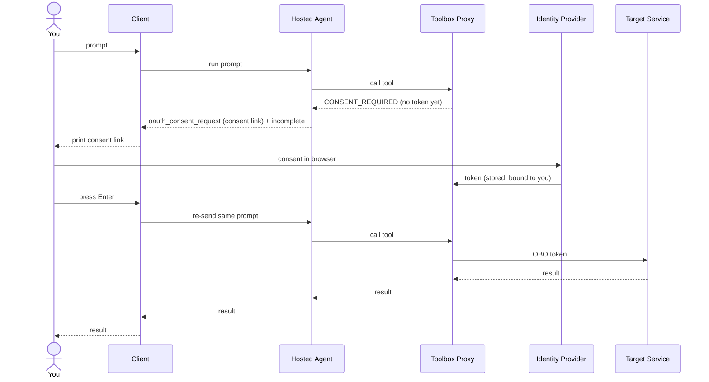

# Hosted Toolbox Auth Paths — OAuth consent client

A REPL client for the [`Hosted-Toolbox-AuthPaths/`](../../Hosted-Toolbox-AuthPaths/) agent that understands the **OAuth user-consent** path.

The plain [`SimpleAgent/`](../SimpleAgent/) REPL is enough for the key-based, agent-identity, and inline-`Authorization` tools. It is **not** enough for a tool fronted by a **per-user OAuth connection** (for example a delegated Microsoft Graph connector or a Logic Apps connector), because that tool cannot run until the end user has consented. This client handles that flow.

## What it does

When a toolbox tool source needs the user's delegated token, the hosted agent surfaces an `oauth_consent_request` output item that carries a **consent link** and marks the response `incomplete`. This client:

1. Detects the `oauth_consent_request` and extracts the consent link.
2. **Prints the consent link** so you can open it in any browser and complete the OAuth flow out of band. It never auto-opens a browser, so it works in headless, SSH, and container shells.
3. Waits for you to press Enter, then **re-sends the original prompt on the same session**. The toolbox proxy now holds your delegated token, so the retried tool call succeeds.

> **Why re-send instead of replying with an approval?** An OAuth consent request records no approval-id mapping on the server, so a `ToolApprovalResponseContent` (`CreateResponse(...)`) reply would be rejected. The user's token lives on the proxy after consent, so simply re-sending the same prompt resumes the call. Function-tool approvals are different: those *do* use `CreateResponse(...)`, and this client handles them too for completeness.

## How the consent flows (no token ever touches this client)



The client never sees the user's token. Consent and the on-behalf-of token exchange happen entirely between the user, the identity provider, and the toolbox proxy.

## Prerequisites

- The [`Hosted-Toolbox-AuthPaths/`](../../Hosted-Toolbox-AuthPaths/) agent running (locally or deployed) with at least one toolbox tool source configured for a per-user OAuth connection. See that sample's README, **Auth path #4 (OAuth user consent)**.
- `az login` so the client can mint a bearer token to reach the agent endpoint.

## Run

```powershell
cd Hosted-Toolbox-AuthPaths-Client

# Against the local dev server (the {project} segment is a wildcard the server ignores):
$env:AZURE_AI_PROJECT_ENDPOINT = "http://localhost:8088/api/projects/local"
$env:AZURE_AI_AGENT_NAME       = "hosted-toolbox-auth-paths-agent"

# Or against a deployed agent:
# $env:AZURE_AI_PROJECT_ENDPOINT = "https://<account>.services.ai.azure.com/api/projects/<project>"
# $env:AZURE_AI_AGENT_NAME       = "hosted-toolbox-auth-paths-agent"

dotnet run --tl:off
```

Then ask something that needs the OAuth-protected tool. When the consent prompt appears, the client prints the consent link. Open it in any browser, complete sign-in, then press Enter and the client re-sends automatically.

## Environment variables

| Variable | Required | Default | Notes |
|---|---|---|---|
| `AZURE_AI_PROJECT_ENDPOINT` | yes | — | Foundry project endpoint, or the local dev server base. `FOUNDRY_PROJECT_ENDPOINT` is read as a fallback. |
| `AZURE_AI_AGENT_NAME` | no | `hosted-toolbox-auth-paths-agent` | Registered server-side agent name. |
