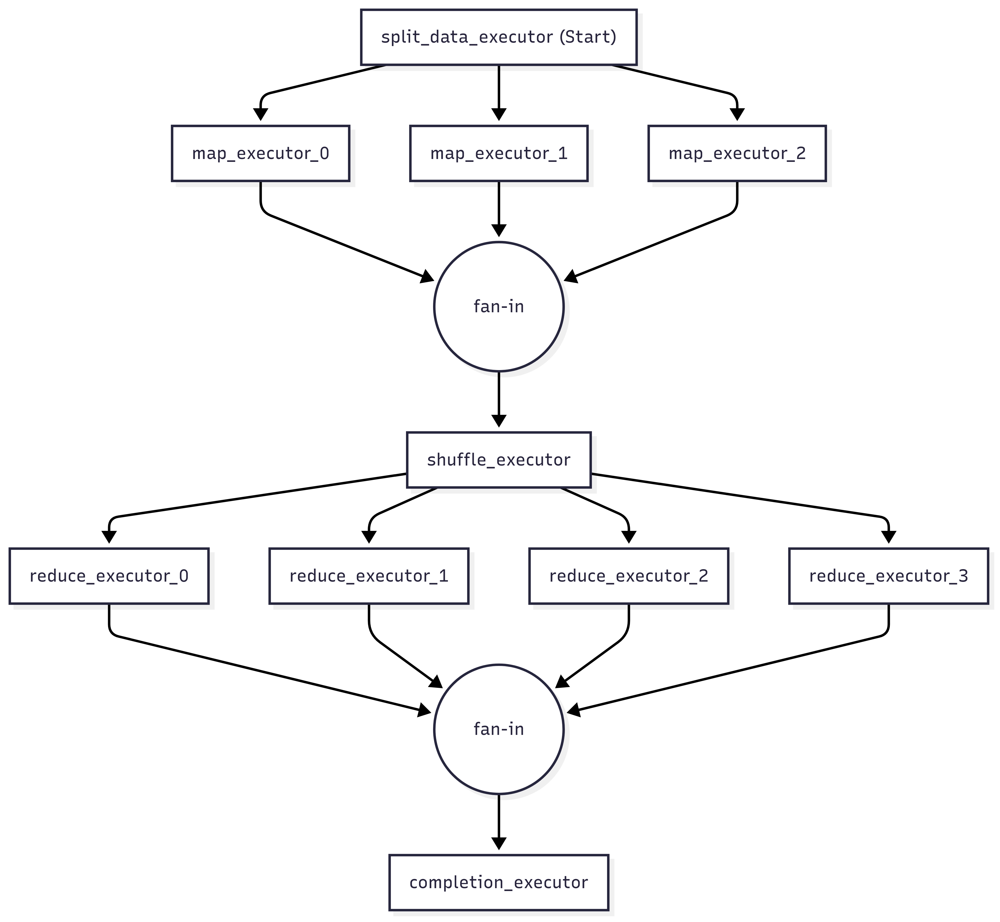

# Workflow Visualization Sample

This sample demonstrates how to visualize workflows using `ToMermaidString()` and `ToDotString()` extension methods. It uses a map-reduce workflow with fan-out/fan-in patterns as an example.

## Running the Sample

```bash
dotnet run
```

## Output Formats

The sample generates two visualization formats:

### Mermaid
Paste the output into any Mermaid-compatible viewer (GitHub, Mermaid Live Editor, etc.):



### DOT (Graphviz)
Render with Graphviz (requires `graphviz` to be installed):

```bash
dotnet run | tail -n +20 | dot -Tpng -o workflow.png
```


## Usage

```csharp
Workflow workflow = BuildWorkflow();

// Generate Mermaid format
string mermaid = workflow.ToMermaidString();

// Generate DOT format
string dotString = workflow.ToDotString();
```
