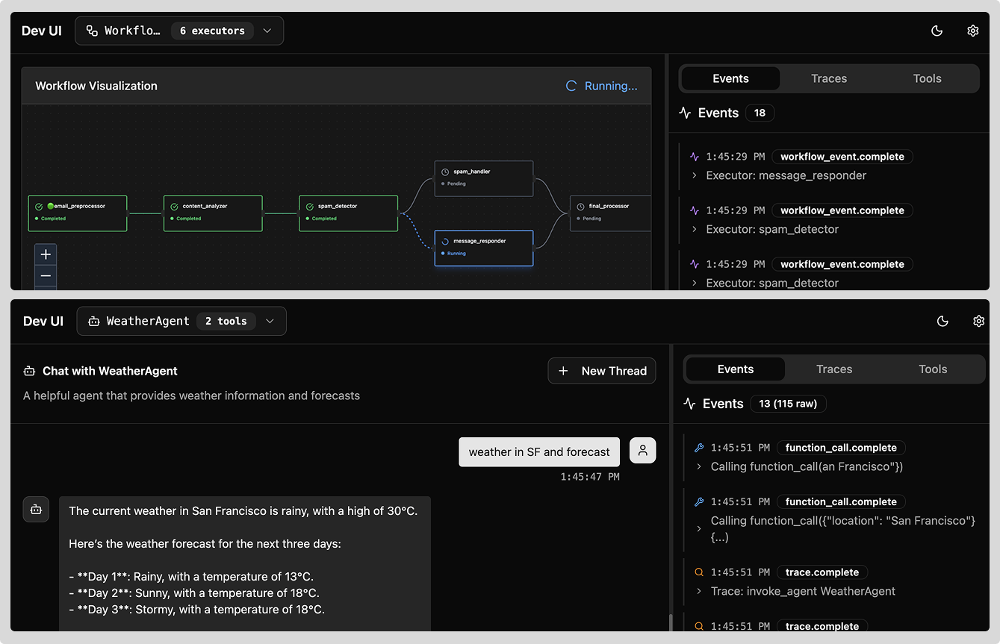

# DevUI - Agent Framework Debug Interface

A lightweight, standalone sample app interface for running entities (agents/workflows) in the Microsoft Agent Framework supporting both **directory-based discovery** and **in-memory entity registration**.

> [!IMPORTANT]
> DevUI is a **sample app** to help you get started with the Agent Framework. It is **not** intended for production use. For production, or for features beyond what is provided in this sample app, it is recommended that you build your own custom interface and API server using the Agent Framework SDK.



## Quick Start

```bash
# Install
pip install agent-framework-devui

# Launch web UI + API server
devui ./agents --port 8080
# → Web UI: http://localhost:8080
# → API: http://localhost:8080/v1/*
```

You can also launch it programmatically

```python
from agent_framework import ChatAgent
from agent_framework.openai import OpenAIChatClient
from agent_framework.devui import serve

def get_weather(location: str) -> str:
    """Get weather for a location."""
    return f"Weather in {location}: 72°F and sunny"

# Create your agent
agent = ChatAgent(
    name="WeatherAgent",
    chat_client=OpenAIChatClient(),
    tools=[get_weather]
)

# Launch debug UI - that's it!
serve(entities=[agent], auto_open=True)
# → Opens browser to http://localhost:8080
```

## Directory Structure

For your agents to be discovered by the DevUI, they must be organized in a directory structure like below. Each agent/workflow must have an `__init__.py` that exports the required variable (`agent` or `workflow`).

**Note**: `.env` files are optional but will be automatically loaded if present in the agent/workflow directory or parent entities directory. Use them to store API keys, configuration variables, and other environment-specific settings.

```
agents/
├── weather_agent/
│   ├── __init__.py      # Must export: agent = ChatAgent(...)
│   ├── agent.py
│   └── .env             # Optional: API keys, config vars
├── my_workflow/
│   ├── __init__.py      # Must export: workflow = WorkflowBuilder()...
│   ├── workflow.py
│   └── .env             # Optional: environment variables
└── .env                 # Optional: shared environment variables
```

## OpenAI-Compatible API

For convenience, you can interact with the agents/workflows using the standard OpenAI API format. Just specify the `entity_id` in the `extra_body` field. This can be an `agent_id` or `workflow_id`.

```bash
# Standard OpenAI format
curl -X POST http://localhost:8080/v1/responses \
  -H "Content-Type: application/json" \
  -d @- << 'EOF'
{
  "model": "agent-framework",
  "input": "Hello world",
  "extra_body": {"entity_id": "weather_agent"}
}
EOF
```

Messages and events from agents/workflows are mapped to OpenAI response types in `agent_framework_devui/_mapper.py`. See the mapping table below:

| Agent Framework Content           | OpenAI Event                              | Type     |
| --------------------------------- | ----------------------------------------- | -------- |
| `TextContent`                     | `ResponseTextDeltaEvent`                  | Official |
| `TextReasoningContent`            | `ResponseReasoningTextDeltaEvent`         | Official |
| `FunctionCallContent`             | `ResponseFunctionCallArgumentsDeltaEvent` | Official |
| `FunctionResultContent`           | `ResponseFunctionResultComplete`          | Custom   |
| `ErrorContent`                    | `ResponseErrorEvent`                      | Official |
| `UsageContent`                    | `ResponseUsageEventComplete`              | Custom   |
| `DataContent`                     | `ResponseTraceEventComplete`              | Custom   |
| `UriContent`                      | `ResponseTraceEventComplete`              | Custom   |
| `HostedFileContent`               | `ResponseTraceEventComplete`              | Custom   |
| `HostedVectorStoreContent`        | `ResponseTraceEventComplete`              | Custom   |
| `FunctionApprovalRequestContent`  | Custom event                              | Custom   |
| `FunctionApprovalResponseContent` | Custom event                              | Custom   |
| `WorkflowEvent`                   | `ResponseWorkflowEventComplete`           | Custom   |

## CLI Options

```bash
devui [directory] [options]

Options:
  --port, -p      Port (default: 8080)
  --host          Host (default: 127.0.0.1)
  --headless      API only, no UI
  --config        YAML config file
  --tracing       none|framework|workflow|all
  --reload        Enable auto-reload
```

## Key Endpoints

- `GET /v1/entities` - List discovered agents/workflows
- `GET /v1/entities/{entity_id}/info` - Get detailed entity information
- `POST /v1/responses` - Execute agent/workflow (streaming or sync)
- `GET /health` - Health check
- `POST /v1/threads` - Create thread for agent (optional)
- `GET /v1/threads?agent_id={id}` - List threads for agent
- `GET /v1/threads/{thread_id}` - Get thread info
- `DELETE /v1/threads/{thread_id}` - Delete thread
- `GET /v1/threads/{thread_id}/messages` - Get thread messages

## Implementation

- **Discovery**: `agent_framework_devui/_discovery.py`
- **Execution**: `agent_framework_devui/_executor.py`
- **Message Mapping**: `agent_framework_devui/_mapper.py`
- **Session Management**: `agent_framework_devui/_session.py`
- **API Server**: `agent_framework_devui/_server.py`
- **CLI**: `agent_framework_devui/_cli.py`

## Examples

See `samples/` for working agent and workflow implementations.

## License

MIT
