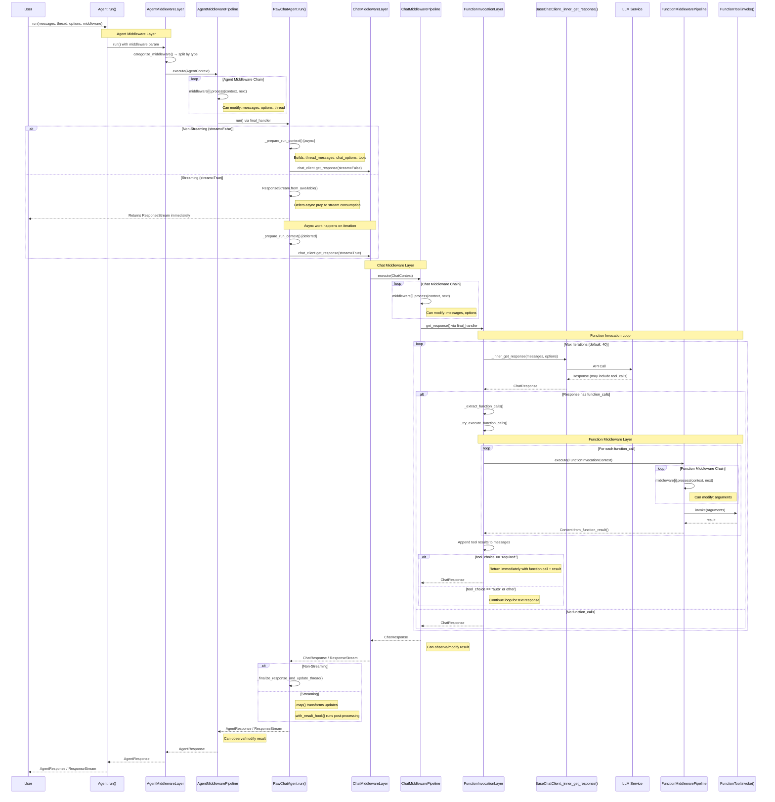

# Tools and Middleware: Request Flow Architecture

This document describes the complete request flow when using an Agent with middleware and tools, from the initial `Agent.run()` call through middleware layers, function invocation, and back to the caller.

## Overview

The Agent Framework uses a layered architecture with three distinct middleware/processing layers:

1. **Agent Middleware Layer** - Wraps the entire agent execution
2. **Chat Middleware Layer** - Wraps calls to the chat client
3. **Function Middleware Layer** - Wraps individual tool/function invocations

Each layer provides interception points where you can modify inputs, inspect outputs, or alter behavior.

## Flow Diagram



## Layer Details

### 1. Agent Middleware Layer (`AgentMiddlewareLayer`)

**Entry Point:** `Agent.run(messages, thread, options, middleware)`

**Context Object:** `AgentContext`

| Field | Type | Description |
|-------|------|-------------|
| `agent` | `SupportsAgentRun` | The agent being invoked |
| `messages` | `list[ChatMessage]` | Input messages (mutable) |
| `thread` | `AgentThread \| None` | Conversation thread |
| `options` | `Mapping[str, Any]` | Chat options dict |
| `stream` | `bool` | Whether streaming is enabled |
| `metadata` | `dict` | Shared data between middleware |
| `result` | `AgentResponse \| None` | Set after `next()` is called |
| `kwargs` | `Mapping[str, Any]` | Additional run arguments |

**Key Operations:**
1. `categorize_middleware()` separates middleware by type (agent, chat, function)
2. Chat and function middleware are forwarded to `chat_client`
3. `AgentMiddlewarePipeline.execute()` runs the agent middleware chain
4. Final handler calls `RawChatAgent.run()`

**What Can Be Modified:**
- `context.messages` - Add, remove, or modify input messages
- `context.options` - Change model parameters, temperature, etc.
- `context.thread` - Replace or modify the thread
- `context.result` - Override the final response (after `next()`)

### 2. Chat Middleware Layer (`ChatMiddlewareLayer`)

**Entry Point:** `chat_client.get_response(messages, options)`

**Context Object:** `ChatContext`

| Field | Type | Description |
|-------|------|-------------|
| `chat_client` | `ChatClientProtocol` | The chat client |
| `messages` | `Sequence[ChatMessage]` | Messages to send |
| `options` | `Mapping[str, Any]` | Chat options |
| `stream` | `bool` | Whether streaming |
| `metadata` | `dict` | Shared data between middleware |
| `result` | `ChatResponse \| None` | Set after `next()` is called |
| `kwargs` | `Mapping[str, Any]` | Additional arguments |

**Key Operations:**
1. `ChatMiddlewarePipeline.execute()` runs the chat middleware chain
2. Final handler calls `FunctionInvocationLayer.get_response()`
3. Stream hooks can be registered for streaming responses

**What Can Be Modified:**
- `context.messages` - Inject system prompts, filter content
- `context.options` - Change model, temperature, tool_choice
- `context.result` - Override the response (after `next()`)

### 3. Function Invocation Layer (`FunctionInvocationLayer`)

**Entry Point:** `FunctionInvocationLayer.get_response()`

This layer manages the tool execution loop:

1. **Calls** `BaseChatClient._inner_get_response()` to get LLM response
2. **Extracts** function calls from the response
3. **Executes** functions through the Function Middleware Pipeline
4. **Appends** results to messages and loops back to step 1

**Configuration:** `FunctionInvocationConfiguration`

| Setting | Default | Description |
|---------|---------|-------------|
| `enabled` | `True` | Enable auto-invocation |
| `max_iterations` | `40` | Maximum tool execution loops |
| `max_consecutive_errors_per_request` | `3` | Error threshold before stopping |
| `terminate_on_unknown_calls` | `False` | Raise error for unknown tools |
| `additional_tools` | `[]` | Extra tools to register |
| `include_detailed_errors` | `False` | Include exceptions in results |

**`tool_choice` Behavior:**

The `tool_choice` option controls how the model uses available tools:

| Value | Behavior |
|-------|----------|
| `"auto"` | Model decides whether to call a tool or respond with text. After tool execution, the loop continues to get a text response. |
| `"none"` | Model is prevented from calling tools, will only respond with text. |
| `"required"` | Model **must** call a tool. After tool execution, returns immediately with the function call and result—**no additional model call** is made. |
| `{"mode": "required", "required_function_name": "fn"}` | Model must call the specified function. Same return behavior as `"required"`. |

**Why `tool_choice="required"` returns immediately:**

When you set `tool_choice="required"`, your intent is to force one or more tool calls (not all models supports multiple, either by name or when using `required` without a name). The framework respects this by:
1. Getting the model's function call(s)
2. Executing the tool(s)
3. Returning the response(s) with both the function call message(s) and the function result(s)

This avoids an infinite loop (model forced to call tools → executes → model forced to call tools again) and gives you direct access to the tool result.

```python
# With tool_choice="required", response contains function call + result only
response = await client.get_response(
    "What's the weather?",
    options={"tool_choice": "required", "tools": [get_weather]}
)

# response.messages contains:
# [0] Assistant message with function_call content
# [1] Tool message with function_result content
# (No text response from model)

# To get a text response after tool execution, use tool_choice="auto"
response = await client.get_response(
    "What's the weather?",
    options={"tool_choice": "auto", "tools": [get_weather]}
)
# response.text contains the model's interpretation of the weather data
```

### 4. Function Middleware Layer (`FunctionMiddlewarePipeline`)

**Entry Point:** Called per function invocation within `_auto_invoke_function()`

**Context Object:** `FunctionInvocationContext`

| Field | Type | Description |
|-------|------|-------------|
| `function` | `FunctionTool` | The function being invoked |
| `arguments` | `BaseModel` | Validated Pydantic arguments |
| `metadata` | `dict` | Shared data between middleware |
| `result` | `Any` | Set after `next()` is called |
| `kwargs` | `Mapping[str, Any]` | Runtime kwargs |

**What Can Be Modified:**
- `context.arguments` - Modify validated arguments before execution
- `context.result` - Override the function result (after `next()`)
- Raise `MiddlewareTermination` to skip execution and terminate the function invocation loop

**Special Behavior:** When `MiddlewareTermination` is raised in function middleware, it signals that the function invocation loop should exit **without making another LLM call**. This is useful when middleware determines that no further processing is needed (e.g., a termination condition is met).

```python
class TerminatingMiddleware(FunctionMiddleware):
    async def process(self, context: FunctionInvocationContext, next):
        if self.should_terminate(context):
            context.result = "terminated by middleware"
            raise MiddlewareTermination  # Exit function invocation loop
        await next(context)
```

## Arguments Added/Altered at Each Layer

### Agent Layer → Chat Layer

```python
# RawChatAgent._prepare_run_context() builds:
{
    "thread": AgentThread,          # Validated/created thread
    "input_messages": [...],        # Normalized input messages
    "thread_messages": [...],       # Messages from thread + context + input
    "agent_name": "...",            # Agent name for attribution
    "chat_options": {
        "model_id": "...",
        "conversation_id": "...",   # From thread.service_thread_id
        "tools": [...],             # Normalized tools + MCP tools
        "temperature": ...,
        "max_tokens": ...,
        # ... other options
    },
    "filtered_kwargs": {...},       # kwargs minus 'chat_options'
    "finalize_kwargs": {...},       # kwargs with 'thread' added
}
```

### Chat Layer → Function Layer

```python
# Passed through to FunctionInvocationLayer:
{
    "messages": [...],              # Prepared messages
    "options": {...},               # Mutable copy of chat_options
    "function_middleware": [...],   # Function middleware from kwargs
}
```

### Function Layer → Tool Invocation

```python
# FunctionInvocationContext receives:
{
    "function": FunctionTool,       # The tool to invoke
    "arguments": BaseModel,         # Validated from function_call.arguments
    "kwargs": {
        # Runtime kwargs (filtered, no conversation_id)
    },
}
```

### Tool Result → Back Up

```python
# Content.from_function_result() creates:
{
    "type": "function_result",
    "call_id": "...",               # From function_call.call_id
    "result": ...,                  # Serialized tool output
    "exception": "..." | None,      # Error message if failed
}
```

## Middleware Control Flow

There are three ways to exit a middleware's `process()` method:

### 1. Return Normally (with or without calling `next`)

Returns control to the upstream middleware, allowing its post-processing code to run.

```python
class CachingMiddleware(FunctionMiddleware):
    async def process(self, context: FunctionInvocationContext, next):
        # Option A: Return early WITHOUT calling next (skip downstream)
        if cached := self.cache.get(context.function.name):
            context.result = cached
            return  # Upstream post-processing still runs

        # Option B: Call next, then return normally
        await next(context)
        self.cache[context.function.name] = context.result
        return  # Normal completion
```

### 2. Raise `MiddlewareTermination`

Immediately exits the entire middleware chain. Upstream middleware's post-processing code is **skipped**.

```python
class BlockedFunctionMiddleware(FunctionMiddleware):
    async def process(self, context: FunctionInvocationContext, next):
        if context.function.name in self.blocked_functions:
            context.result = "Function blocked by policy"
            raise MiddlewareTermination("Blocked")  # Skips ALL post-processing
        await next(context)
```

### 3. Raise Any Other Exception

Bubbles up to the caller. The middleware chain is aborted and the exception propagates.

```python
class ValidationMiddleware(FunctionMiddleware):
    async def process(self, context: FunctionInvocationContext, next):
        if not self.is_valid(context.arguments):
            raise ValueError("Invalid arguments")  # Bubbles up to user
        await next(context)
```

## `return` vs `raise MiddlewareTermination`

The key difference is what happens to **upstream middleware's post-processing**:

```python
class MiddlewareA(AgentMiddleware):
    async def process(self, context, next):
        print("A: before")
        await next(context)
        print("A: after")  # Does this run?

class MiddlewareB(AgentMiddleware):
    async def process(self, context, next):
        print("B: before")
        context.result = "early result"
        # Choose one:
        return                              # Option 1
        # raise MiddlewareTermination()    # Option 2
```

With middleware registered as `[MiddlewareA, MiddlewareB]`:

| Exit Method | Output |
|-------------|--------|
| `return` | `A: before` → `B: before` → `A: after` |
| `raise MiddlewareTermination` | `A: before` → `B: before` (no `A: after`) |

**Use `return`** when you want upstream middleware to still process the result (e.g., logging, metrics).

**Use `raise MiddlewareTermination`** when you want to completely bypass all remaining processing (e.g., blocking a request, returning cached response without any modification).

## Calling `next()` or Not

The decision to call `next(context)` determines whether downstream middleware and the actual operation execute:

### Without calling `next()` - Skip downstream

```python
async def process(self, context, next):
    context.result = "replacement result"
    return  # Downstream middleware and actual execution are SKIPPED
```

- Downstream middleware: ❌ NOT executed
- Actual operation (LLM call, function invocation): ❌ NOT executed
- Upstream middleware post-processing: ✅ Still runs (unless `MiddlewareTermination` raised)
- Result: Whatever you set in `context.result`

### With calling `next()` - Full execution

```python
async def process(self, context, next):
    # Pre-processing
    await next(context)  # Execute downstream + actual operation
    # Post-processing (context.result now contains real result)
    return
```

- Downstream middleware: ✅ Executed
- Actual operation: ✅ Executed
- Upstream middleware post-processing: ✅ Runs
- Result: The actual result (possibly modified in post-processing)

### Summary Table

| Exit Method | Call `next()`? | Downstream Executes? | Actual Op Executes? | Upstream Post-Processing? |
|-------------|----------------|---------------------|---------------------|--------------------------|
| `return` (or implicit) | Yes | ✅ | ✅ | ✅ Yes |
| `return` | No | ❌ | ❌ | ✅ Yes |
| `raise MiddlewareTermination` | No | ❌ | ❌ | ❌ No |
| `raise MiddlewareTermination` | Yes | ✅ | ✅ | ❌ No |
| `raise OtherException` | Either | Depends | Depends | ❌ No (exception propagates) |

> **Note:** The first row (`return` after calling `next()`) is the default behavior. Python functions implicitly return `None` at the end, so simply calling `await next(context)` without an explicit `return` statement achieves this pattern.

## Streaming vs Non-Streaming

The `run()` method handles streaming and non-streaming differently:

### Non-Streaming (`stream=False`)

Returns `Awaitable[AgentResponse]`:

```python
async def _run_non_streaming():
    ctx = await self._prepare_run_context(...)  # Async preparation
    response = await self.chat_client.get_response(stream=False, ...)
    await self._finalize_response_and_update_thread(...)
    return AgentResponse(...)
```

### Streaming (`stream=True`)

Returns `ResponseStream[AgentResponseUpdate, AgentResponse]` **synchronously**:

```python
# Async preparation is deferred using ResponseStream.from_awaitable()
async def _get_stream():
    ctx = await self._prepare_run_context(...)  # Deferred until iteration
    return self.chat_client.get_response(stream=True, ...)

return (
    ResponseStream.from_awaitable(_get_stream())
    .map(
        transform=map_chat_to_agent_update,  # Transform each update
        finalizer=self._finalize_response_updates,  # Build final response
    )
    .with_result_hook(_post_hook)  # Post-processing after finalization
)
```

Key points:
- `ResponseStream.from_awaitable()` wraps an async function, deferring execution until the stream is consumed
- `.map()` transforms `ChatResponseUpdate` → `AgentResponseUpdate` and provides the finalizer
- `.with_result_hook()` runs after finalization (e.g., notify thread of new messages)

## See Also

- [Middleware Samples](../../getting_started/middleware/) - Examples of custom middleware
- [Function Tool Samples](../../getting_started/tools/) - Creating and using tools
