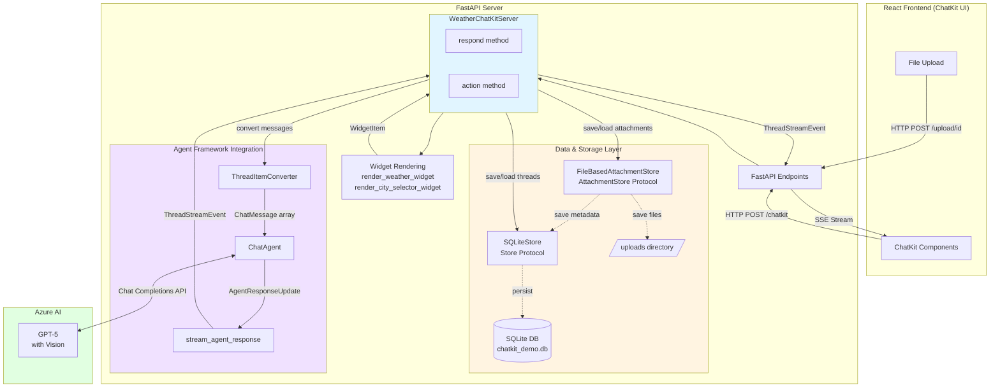

# ChatKit Integration Sample with Weather Agent and Image Analysis

This sample demonstrates how to integrate Microsoft Agent Framework with OpenAI ChatKit. It provides a complete implementation of a weather assistant with interactive widget visualization, image analysis, and file upload support.

**Features:**

- Weather information with interactive widgets
- Image analysis using vision models
- Current time queries
- File upload with attachment storage
- Chat interface with streaming responses
- City selector widget with one-click weather

## Architecture



### Server Implementation

The sample implements a ChatKit server using the `ChatKitServer` base class from the `chatkit` package:

**Core Components:**

- **`WeatherChatKitServer`**: Custom ChatKit server implementation that:

  - Extends `ChatKitServer[dict[str, Any]]`
  - Uses Agent Framework's `ChatAgent` with Azure OpenAI
  - Converts ChatKit messages to Agent Framework format using `ThreadItemConverter`
  - Streams responses back to ChatKit using `stream_agent_response`
  - Creates and streams interactive widgets after agent responses

- **`SQLiteStore`**: Data persistence layer that:

  - Implements the `Store[dict[str, Any]]` protocol from ChatKit
  - Persists threads, messages, and attachment metadata in SQLite
  - Provides thread management and item history
  - Stores attachment metadata for the upload lifecycle

- **`FileBasedAttachmentStore`**: File storage implementation that:
  - Implements the `AttachmentStore[dict[str, Any]]` protocol from ChatKit
  - Stores uploaded files on the local filesystem (in `./uploads` directory)
  - Generates upload URLs for two-phase file upload
  - Saves attachment metadata to the data store for upload tracking
  - Provides preview URLs for images

**Key Integration Points:**

```python
# Converting ChatKit messages to Agent Framework
converter = ThreadItemConverter(
    attachment_data_fetcher=self._fetch_attachment_data
)
agent_messages = await converter.to_agent_input(user_message_item)

# Running agent and streaming back to ChatKit
async for event in stream_agent_response(
    self.weather_agent.run_stream(agent_messages),
    thread_id=thread.id,
):
    yield event

# Streaming widgets
widget = render_weather_widget(weather_data)
async for event in stream_widget(thread_id=thread.id, widget=widget):
    yield event
```

## Installation and Setup

### Prerequisites

- Python 3.10+
- Node.js 18.18+ and npm 9+
- Azure OpenAI service configured
- Azure CLI for authentication (`az login`)

### Network Requirements

> **Important:** This sample uses the OpenAI ChatKit frontend, which requires internet connectivity to OpenAI services.

The frontend makes outbound requests to:

- `cdn.platform.openai.com` - ChatKit UI library (required)
- `chatgpt.com` - Configuration endpoint
- `api-js.mixpanel.com` - Telemetry

**This sample is not suitable for air-gapped or network-restricted environments.** The ChatKit frontend library cannot be self-hosted. See [Limitations](#limitations) for details.

### Domain Key Configuration

For **local development**, the sample uses a default domain key (`domain_pk_localhost_dev`).

For **production deployment**:

1. Register your domain at [platform.openai.com](https://platform.openai.com/settings/organization/security/domain-allowlist)
2. Create a `.env` file in the `frontend` directory:

   ```
   VITE_CHATKIT_API_DOMAIN_KEY=your_domain_key_here
   ```

### Backend Setup

1. **Install Python packages:**

```bash
cd python/samples/demos/chatkit-integration
pip install agent-framework-chatkit fastapi uvicorn azure-identity
```

2. **Configure Azure OpenAI:**

```bash
export AZURE_OPENAI_ENDPOINT="https://your-resource.openai.azure.com/"
export AZURE_OPENAI_API_VERSION="2024-06-01"
export AZURE_OPENAI_CHAT_DEPLOYMENT_NAME="gpt-4o"
```

3. **Authenticate with Azure:**

```bash
az login
```

### Frontend Setup

Install the Node.js dependencies:

```bash
cd frontend
npm install
```

## How to Run

### Start the Backend Server

From the `chatkit-integration` directory:

```bash
python app.py
```

Or with auto-reload for development:

```bash
uvicorn app:app --host 127.0.0.1 --port 8001 --reload
```

The backend will start on `http://localhost:8001`

### Start the Frontend Development Server

In a new terminal, from the `frontend` directory:

```bash
npm run dev
```

The frontend will start on `http://localhost:5171`

### Access the Application

Open your browser and navigate to:

```
http://localhost:5171
```

You can now:

- Ask about weather in any location (weather widgets display automatically)
- Upload images for analysis using the attachment button
- Get the current time
- Ask to see available cities and click city buttons for instant weather

### Project Structure

```
chatkit-integration/
├── app.py                    # FastAPI backend with ChatKitServer implementation
├── store.py                  # SQLiteStore implementation
├── attachment_store.py       # FileBasedAttachmentStore implementation
├── weather_widget.py         # Widget rendering functions
├── chatkit_demo.db          # SQLite database (auto-created)
├── uploads/                  # Uploaded files directory (auto-created)
└── frontend/
    ├── package.json
    ├── vite.config.ts
    ├── index.html
    └── src/
        ├── main.tsx
        └── App.tsx           # ChatKit UI integration
```

### Configuration

You can customize the application by editing constants at the top of `app.py`:

```python
# Server configuration
SERVER_HOST = "127.0.0.1"  # Bind to localhost only for security (local dev)
SERVER_PORT = 8001
SERVER_BASE_URL = f"http://localhost:{SERVER_PORT}"

# Database configuration
DATABASE_PATH = "chatkit_demo.db"

# File storage configuration
UPLOADS_DIRECTORY = "./uploads"

# User context
DEFAULT_USER_ID = "demo_user"
```

### Sample Conversations

Try these example queries:

- "What's the weather like in Tokyo?"
- "Show me available cities" (displays interactive city selector)
- "What's the current time?"
- Upload an image and ask "What do you see in this image?"

## Limitations

### Air-Gapped / Regulated Environments

The ChatKit frontend (`chatkit.js`) is loaded from OpenAI's CDN and cannot be self-hosted. This means:

- **Not suitable for air-gapped environments** where `*.openai.com` is blocked
- **Not suitable for regulated environments** that prohibit external telemetry
- **Requires domain registration** with OpenAI for production use

**What you CAN self-host:**

- The Python backend (FastAPI server, `ChatKitServer`, stores)
- The `agent-framework-chatkit` integration layer
- Your LLM infrastructure (Azure OpenAI, local models, etc.)

**What you CANNOT self-host:**

- The ChatKit frontend UI library

For more details, see:

- [openai/chatkit-js#57](https://github.com/openai/chatkit-js/issues/57) - Self-hosting feature request
- [openai/chatkit-js#76](https://github.com/openai/chatkit-js/issues/76) - Domain key requirements

## Learn More

- [Agent Framework Documentation](https://aka.ms/agent-framework)
- [ChatKit Documentation](https://platform.openai.com/docs/guides/chatkit)
- [Azure OpenAI Documentation](https://learn.microsoft.com/en-us/azure/ai-foundry/)
